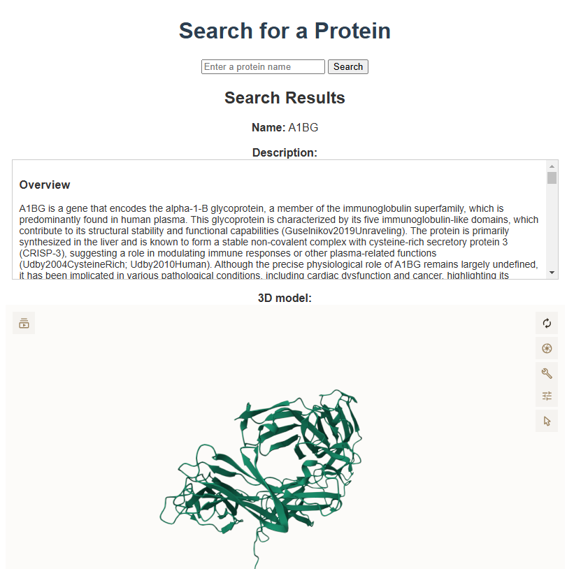
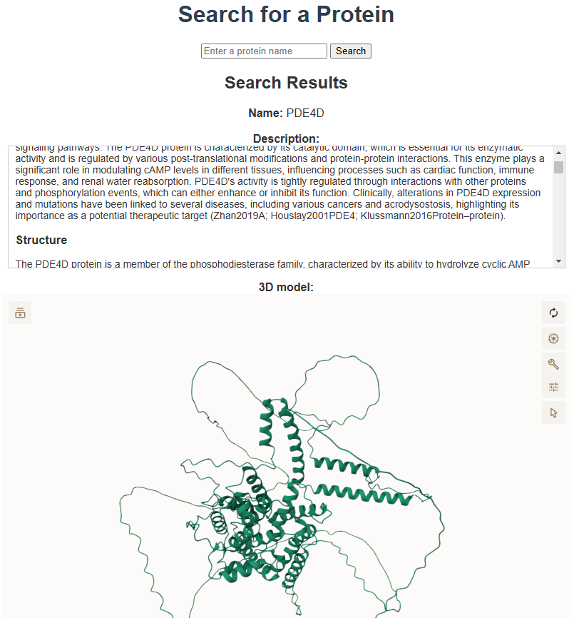

# Protein Structure Search Engine

This is a web server application for viewing Protein structures.

Access the website here: [https://proteinsearch.dthung.com/](https://proteinsearch.dthung.com/). If you don't know what protein name to enter, try some of these: ABCC1, KCNJ16, LDHAL6B, MAP3K6, TCEANC2,...

## Main component

The application is deployed on AWS using the following steps:

1. **Databases**:
   - Create a database and a new table based on the SQL queries in [deployment_files/SQL_queries.sql](deployment_files/SQL_queries.sql).

2. **Data Pipeline**: The [data_pipeline](deployment_files/data_pipeline) folder contains the scripts to interact with the database. To run the pipeline, execute the following steps:
   - Download data from this Google Cloud Storage: `gs://fh-public/wikicrow2` to [deployment_files/data_pipeline/data/wikicrow2](deployment_files/data_pipeline/data/wikicrow2).
   - Use [add_pro_des_to_db.py](deployment_files/data_pipeline/add_pro_des_to_db.py) to add the protein names and descriptions from the [data/wikicrow2](deployment_files/data_pipeline/data/wikicrow2).
   - Use [add_pdb_to_db.py](deployment_files/data_pipeline/add_pdb_to_db.py) to fetch the PDB file for the 3D model from the internet.
   - Use [pipeline_report.log](deployment_files/data_pipeline/pipeline_report.log) contains information about the protein that was not found with the pipelines (Searched through both RCSB and AlphaFold). In the pipelines I couldn't find 3D model of around 1300/20000 proteins (~7%).

3. **Current Deployment with AWS S3 (React/TypeScript) and Lambda (NodeJs/JavaScript)**:
   - The code for the front end to be hosted on AWS S3 is given in [deployment_files/aws_deploy/front_end_react](deployment_files/aws_deploy/front_end_react).
   - The code for two Lambda functions is given in [deployment_files/aws_deploy/lambda_code](deployment_files/aws_deploy/lambda_code).

4. **Old Deployment with Flask and Gunicorn**: The [web_server](deployment_files/web_server) folder contains the Flask application and related files. To run the web server, follow these steps:
   - **NOTE**: This is my old deployment on an AWS EC2 instance instead of AWS Lambda.
   - Connect to your webserver (in my case, AWS EC2).
   - Ensure Gunicorn is installed.
   - Set up an SSL certificate from Let's Encrypt.
   - Start the Gunicorn server with the following command:
     ```bash
     sudo DB_PASSWORD=<YOUR_PASSWORD_FOR_DB> gunicorn --bind 0.0.0.0:443 --certfile=/etc/letsencrypt/live/dthung.xyz/fullchain.pem --keyfile=/etc/letsencrypt/live/dthung.xyz/privkey.pem app:app
     ```
   - This command will start the Gunicorn server and host it on HTTPS.
   - **NOTE**: HTTPS is required as the 3D viewer is an embedded window fetched from another HTTPS source.

### Illustration



